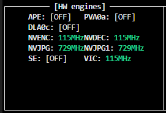

# Edge AI Vehicle Speed Tracker

A production-ready, ultra-low latency vehicle speed tracking and detection system designed specifically for the NVIDIA Jetson Orin platform. The system leverages homography-based perspective transformations and TensorRT-accelerated YOLO tracking to estimate vehicle speeds in real-time.

## Hardware Acceleration

This project is highly optimized for the NVIDIA Jetson architecture. It maximizes performance by offloading compute-intensive workloads from the CPU to dedicated hardware silicon via custom GStreamer pipelines:

- **NVDEC (Hardware Decoder)**: Hardware-decodes the incoming H.264 video feed.
- **VIC (Video Image Compositor)**: Manages hardware-level color space conversions (`NVMM`).
- **NVJPG (JPEG Engine)**: Hardware-encodes individual frames into compressed JPEGs to be streamed over Redis.
- **Tensor Cores**: Executes YOLO inference and ByteTrack algorithms via an optimized TensorRT engine (FP16).
- **NVENC (Hardware Encoder)**: Encodes annotated output segments into high-compression H.264 `.mp4` files with minimal CPU overhead.

### Hardware Engine Utilization



## Mock Live Stream Input

To simulate a real-world RTSP IP camera feed without relying on external network bandwidth during development, this system reads from a [pre-recorded video file](https://www.youtube.com/watch?v=QuUxHIVUoaY).

## Output Demonstration

Below is a raw segment generated entirely on-device by the hardware encoder.

[](https://www.youtube.com/watch?v=CI-22xLMnRE)

## Architecture

The system utilizes a decoupled microservice architecture orchestrated via Docker Compose:

1. **Video Producer (`speed_cam-producer`)**:
   - Executes a pure GStreamer Python pipeline to parse and hardware-decode the input feed.
   - Hardware-encodes frames into JPEG format.
   - Transmits frames to a Redis stream with ultra-low latency.
2. **Redis Buffer**:
   - Operates as a high-throughput, decoupled frame buffer (`network_mode: "host"`).
3. **TRT Consumer (`speed_cam-consumer`)**:
   - Polls Redis for the latest frames.
   - Executes YOLO26n TensorRT tracking.
   - Maps pixel movement to real-world dimensions using a homography matrix defined by the `SPEED_ZONE`.
   - Hardware-encodes annotated rolling video segments.
   - Maintains a rolling CSV log of tracked vehicles and their entry/exit speeds.

## Configuration & Deployment

All configurations are dynamically loaded from `docker-compose.yml`.

### Prerequisites

- NVIDIA Jetson Orin (Nano, NX, or AGX)
- JetPack 6.x (`l4t-ml:r36.2.0-py3` container support)
- Docker & Docker Compose

### Quick Start

```bash
# Clone the repository
git clone <your-repo-url>
cd speed_cam

# Start the pipeline in detached mode
docker-compose up -d --build
```

### Modifying the Speed Zone

The Homography perspective matrix can be adjusted without rebuilding the container. Edit the `SPEED_ZONE` parameter in the `docker-compose.yml`:

```yaml
      # Speed zone polygon: bottom-left;top-left;top-right;bottom-right (image pixels)
      - SPEED_ZONE=435,420;590,202;938,225;1055,464
      # Real-world dimensions of the speed zone in metres
      - ZONE_LENGTH_M=13.2
      - ZONE_WIDTH_M=9.0
```
